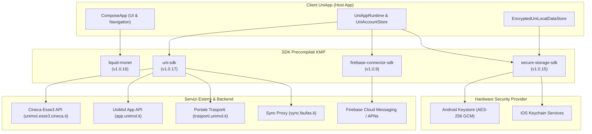
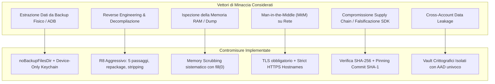

# Ecosistema UniApp: Analisi Tecnica, Sicurezza e Presentazione degli SDK

> **Autore**: Anto426  
> **Target Architetturale**: Kotlin Multiplatform (Android API 29-37, iOS arm64 / simulator arm64)  
> **Data di Analisi**: Settembre 2026  
> **Stato**: Produzione / Aggiornato alle ultime release stabili  

---

## 1. Executive Summary

L'ecosistema **UniApp** per gli studenti dell'Università degli Studi del Molise è progettato secondo un'architettura **completamente disaccoppiata e multi-repository**, basata su **Kotlin Multiplatform (KMP)** e **Compose Multiplatform**.

A differenza delle tradizionali applicazioni universitarie monolitiche (spesso basate su web view o ibride Cordova/Capacitor non mantenute), UniApp adotta una separazione rigorosa delle responsabilità. Il client principale (`uniapp`) non contiene sorgenti diretti dei moduli di base, ma consuma esclusivamente **SDK precompilati e verificati crittograficamente**, pubblicati su GitHub Packages e distribuiti tramite archivi Maven firmati.

L'ecosistema si articola su **4 SDK proprietari**:



| Modulo SDK | Versione Attuale | Coordinate Maven | Scopo e Responsabilità |
| :--- | :--- | :--- | :--- |
| **`secure-storage-sdk`** | `1.0.15` | `com.anto426:secure-storage-sdk` | Storage crittografato device-local basato su hardware keystore nativo (Android Keystore e iOS Keychain). Isolamento a vault, anti-tampering AAD, zero-memory leaks. |
| **`uni-sdk`** | `1.0.17` | `com.anto426:uni-sdk` | Engine di rete KMP per API Cineca Esse3, backend Unimol 3.0, sincronizzazione presenze con QR/GPS, questionari e integrazione reverse-engineered per il portale trasporti. |
| **`firebase-connector-sdk`** | `1.0.9` | `com.anto426:firebase-connector-sdk` | Astrazione reattiva per notifiche push (FCM per Android, bridge nativo per iOS), gestione del ciclo di vita dei token e ricezione asincrona tramite Coroutines Flow. |
| **`liquid-monet`** | `1.0.16` | `com.anto426.liquidmonet:sdk` | Design system Compose Multiplatform con calibrazione hardware persistente, motore colore Monet dinamico e shader per vetro ottico (rifrazione, aberrazione cromatica, blur). |

---

## 2. Presentazione Dettagliata degli SDK

### 2.1. `secure-storage-sdk` — Vault Crittografato Multipiattaforma

Il modulo [`secure-storage-sdk`](file:///home/anto426/Documents/Git/Anto426-Project/01-ecosistema-uniapp/secure-storage-sdk) è progettato per garantire la persistenza sicura di credenziali, token di sessione e cache applicativa senza alcuna dipendenza dal dominio UniApp.

#### Caratteristiche Architetturali
- **Astrazione Agnoscica**: Non conosce utenti, matricole, né tipi dati di UniApp. Fornisce primitive asincrone sospese (`putBytes`, `getBytes`, `remove`, `destroy`) ed estensioni per tipi primitivi e serializzazione JSON.
- **Isolamento per Vault**: Consente la creazione di multipli container (vault) indipendenti tramite `SecureStorageManager`. Ogni profilo studente o ambito applicativo risiede in un vault isolato con una chiave crittografica dedicata.
- **Ciclo di Vita e Distruzione Crittografica**: Il metodo `destroy()` non si limita alla cancellazione dei file, ma revoca ed elimina l'alias della chiave crittografica dall'hardware del dispositivo.

#### Implementazione Android: `AndroidSecureStorage`
- **Algoritmo**: `AES/GCM/NoPadding` a 256 bit.
- **Gestione Chiavi**: Generazione e persistenza all'interno di `AndroidKeyStore`. Le chiavi sono configurate con `KeyProperties.PURPOSE_ENCRYPT or KeyProperties.PURPOSE_DECRYPT` e `setRandomizedEncryptionRequired(true)`. Le chiavi private non sono mai esportabili dalla memoria protetta (TEE/SE).
- **IV e Nonce**: Generati casualmente dal provider hardware per ciascuna singola operazione di scrittura (12 byte / 96 bit).
- **Integrità e AAD (Additional Authenticated Data)**: All'operazione GCM viene passato come AAD il valore `"$scope\u0000$key"`. Questo impedisce qualsiasi attacco di swap di blocchi cifrati tra entry o vault differenti.
- **Formato Busta Cifrata (`USV1`)**:
  ```text
  [0x55, 0x53, 0x56, 0x31] (Magic 4B) | [IV_LEN 1B] | [IV 12B] | [CIPHERTEXT_LEN 4B] | [CIPHERTEXT + GCM_TAG 16B]
  ```
- **Persistenza Atomica**: Scrittura tramite `android.util.AtomicFile` con `sync()` forzato su file descriptor nella directory protetta `context.noBackupFilesDir`, impedendo backup automatici su cloud (Google Drive) o estrazioni non autorizzate via ADB.
- **Offuscamento Nomi**: Nessun PII nei percorsi: sia lo scope sia la chiave sono identificati su filesystem dal loro digest `SHA-256`.

#### Implementazione iOS: `IosSecureStorage`
- **Infrastruttura**: Apple Keychain Services nativo invocato via Kotlin/Native C-Interop (`SecItemAdd`, `SecItemCopyMatching`, `SecItemUpdate`, `SecItemDelete`).
- **Classe e Attributi di Accesso**: `kSecClassGenericPassword` con:
  ```kotlin
  kSecAttrAccessible to kSecAttrAccessibleWhenUnlockedThisDeviceOnly
  ```
  - `WhenUnlocked`: i dati sono decifrabili solo quando il dispositivo è sbloccato dall'utente.
  - `ThisDeviceOnly`: i dati **non vengono mai sincronizzati su iCloud Keychain** e non vengono inclusi nei backup ripristinabili su altri dispositivi fisici.
- **Concorrenza**: Esecuzione su `Dispatchers.Default` con protezione `Mutex`, evitando blocchi della Main UI thread durante le chiamate a Core Foundation.

---

### 2.2. `uni-sdk` — Motore di Rete e Client dei Servizi Universitari

Il modulo [`uni-sdk`](file:///home/anto426/Documents/Git/Anto426-Project/01-ecosistema-uniapp/uni-sdk) rappresenta il cuore logico e di connettività dell'intero ecosistema.

#### Caratteristiche Architetturali
- **Zero UI Dependencies**: Il modulo è completamente puro KMP, privo di riferimenti a Jetpack Compose o al lifecycle Android.
- **Client HTTP Ktor**:
  - Android: `io.ktor:ktor-client-okhttp` (JVM 21, supporto Min SDK 24 / Compile SDK 37).
  - iOS: `io.ktor:ktor-client-darwin` (engine basato su `NSURLSession`).
- **Resilienza e Retry Policy**: Meccanismo automatico `requestCinecaJsonWithRetry` con backoff esponenziale per la gestione di errori 5xx e disconnessioni transitorie dei server universitari.

#### Funzionalità e Canali di Integrazione
1. **Cineca Esse3 REST API (`unimol.esse3.cineca.it/e3rest/api`)**:
   - Autenticazione Basic Auth via TLS per consultazione libretto, righe carriera, medie ponderate e aritmetiche.
   - Calendario appelli d'esame, aperture/chiusure finestre di prenotazione, prenotazione e cancellazione appelli.
   - Piani di studio completi, syllabus delle attività didattiche e ordinamenti didattici.
   - Fatture tasse universitarie e stato pagamenti PagoPA.
   - Recupero metadati badge elettronico ufficiale e codici studente.
2. **Backend Applicativo UniApp (`app.unimol.it/3_0/api`)**:
   - Registrazione e associazione dispositivi (`registra.php`, `aggiornaDeviceInfo.php`).
   - Registrazione presenze a lezione con validazione bidirezionale: lettura QR + verifica coordinate GPS (latitudine, longitudine, accuratezza metrica) tramite `registraPresenza.php`.
   - Bacheca avvisi, news di ateneo e contatti docenti/uffici.
3. **Sync Proxy (`sync.faufas.it/api/v1`)**:
   - Supporto alla compilazione dei questionari di valutazione della didattica con paginazione interattiva, domande obbligatorie/opzionali e salvataggio incrementale di stato.
4. **Portale Trasporti Unimol (`trasporti.unimol.it`)**:
   - Integrazione completa del flusso di prenotazione bus navetta.
   - Parser HTML resiliente capace di estrarre orari, date di viaggio normalizzate, e recupero del ticket originale.
   - Validazione di sicurezza sul download dei biglietti (`loadTransportTicketImage`): verifica dell'origine HTTPS, limitazione a max 3 MiB e validazione dei tipi MIME (PNG, JPEG, WebP o pagine con immagine univoca incorporata).

#### Modello a Capacità: `UniSessionVault` e `TransportSessionVault`
Uno dei punti di forza più rilevanti di `uni-sdk` è la gestione delle sessioni basata su **Capability Tokens**:
- Quando l'utente esegue il login, non riceve una stringa di cookie o un token riutilizzabile arbitrariamente, ma un'istanza dell'oggetto `UniSession`.
- All'interno del vault (`UniSessionVault`), il framework verifica categoricamente che le credenziali in chiaro non siano trattenute:
  ```kotlin
  check(user.password.isNullOrEmpty()) { "A Uni session cannot retain a password" }
  check(user.username.isNullOrEmpty()) { "A Uni session cannot retain login credentials" }
  ```
- Analogamente, per il portale trasporti, i cookie PHP (`PHPSESSID`) sono confinati all'interno del `TransportSessionVault` e mappati su un `TransportSession` opaco: nessun cookie di sessione viene esposto all'applicazione o ai layer UI.

---

### 2.3. `firebase-connector-sdk` — Connettore Notifiche Push

Il modulo [`firebase-connector-sdk`](file:///home/anto426/Documents/Git/Anto426-Project/01-ecosistema-uniapp/firebase-connector-sdk) astrae la complessità dei meccanismi di ricezione push multipiattaforma in un'interfaccia reattiva pulita.

#### Caratteristiche Architetturali
- **Contratto Unificato**:
  ```kotlin
  interface PushNotificationConnector {
      val tokenFlow: StateFlow<String?>
      val messageFlow: Flow<RemotePushMessage>
      suspend fun getDeviceToken(): String?
      suspend fun subscribeToTopic(topic: String): Result<Unit>
      suspend fun unsubscribeFromTopic(topic: String): Result<Unit>
      suspend fun deleteToken(): Result<Unit>
  }
  ```
- **Android**:
  - Utilizza `com.google.firebase:firebase-messaging`.
  - Service dedicato `UniAppFirebaseMessagingService` per intercettare la rotazione dei token (`onNewToken`) e i messaggi in ingresso anche ad app chiusa o in background.
  - Bridge asincrono per i Task GMS tramite coroutine sospese cancellabili (`suspendCancellableCoroutine`).
- **iOS**:
  - Bridge leggero disaccoppiato da Firebase SDK su iOS per ridurre l'impronta binaria e velocizzare le compilazioni native.
  - Espone punti di aggancio per l'AppDelegate nativo (`cacheIosPushToken`, `emitIosPushMessage`, `clearIosPushToken`).
- **Protezione Privacy e Logout**:
  - Il metodo `deleteToken()` distrugge il token FCM registrato e cancella lo stato locale dall'event bus in caso di cambio profilo o disconnessione dell'account.

---

### 2.4. `liquid-monet` — Adaptive Glass UI & Design System

Il modulo [`liquid-monet`](file:///home/anto426/Documents/Git/Anto426-Project/01-ecosistema-uniapp/liquid-monet) costituisce la libreria grafica proprietaria che definisce l'identità visiva di UniApp.

#### Caratteristiche Architetturali e Prestazionali
- **Composability Avanzata**: Componenti Material 3 proprietari (`LiquidTopBar`, `LiquidNavigationBar`, `LiquidCard`, `LiquidButton`, `LiquidTextField`, `LiquidDialog`, `LiquidSheet`, `LiquidToast`).
- **Dynamic Monet Theming**: Estrazione algoritmica di palette cromatiche basate su seed dinamici animati.
- **Effetti Ottici e Shaders**: Simulazione in tempo reale di vetro ottico con rifrazione della luce, aberrazione cromatica e sfocatura multistadio.
- **Calibrazione Hardware Persistente (`DEVICE_CALIBRATION.md`)**:
  - Al primo avvio, l'SDK esegue benchmark mirati su throughput CPU, banda di memoria e capacità di fill-rate della GPU (tramite probe Skia su Metal su iOS e RenderNode su Android).
  - I risultati vengono classificati rispetto a una tabella offline delle famiglie di processori (`PROCESSOR_FAMILIES.md`), determinando un budget computazionale fisso.
  - Se il dispositivo rientra in una fascia prestazionale limitata, gli shader e il campionamento del backdrop vengono automaticamente scalati o disattivati per garantire i **60/120 FPS costanti**, prevenendo surriscaldamento e consumo anomalo della batteria.

---

## 3. Analisi Approfondita della Sicurezza

L'architettura di sicurezza di UniApp e dei suoi SDK è stata strutturata secondo i principi di **Defense in Depth**, **Least Privilege** e **Zero Trust** per l'archiviazione locale.



### 3.1. Crittografia a Riposo (Data at Rest)

| Piattaforma | Meccanismo | Algoritmo | Gestione Chiavi | Rischio Mitigato |
| :--- | :--- | :--- | :--- | :--- |
| **Android** | `AndroidSecureStorage` | **AES-256-GCM** | Hardware Keystore (TEE/StrongBox), chiave non esportabile | Estrazione database, dump NAND, furto del dispositivo spento o bloccato |
| **iOS** | `IosSecureStorage` | **Apple Keychain** | Secure Enclave (`kSecAttrAccessibleWhenUnlockedThisDeviceOnly`) | Estrazione da backup iCloud, sincronizzazione non autorizzata tra dispositivi |

#### Punti di Eccellenza Rilevati:
1. **Legame Crittografico AAD**: In `AndroidSecureStorage.kt`, l'inclusione dell'AAD calcolato come `"$scope\u0000$key"` garantisce che un record cifrato non possa essere spostato all'interno di un'altra cartella o riutilizzato per un'altra chiave di memoria. Se il file viene rinominato o spostato in un altro vault, `AEADBadTagException` scatta immediatamente invalidando il contenuto.
2. **Esclusione Automatica dai Backup**: L'archiviazione in `context.noBackupFilesDir` garantisce che il meccanismo di backup automatico di Android (introdottosi con Android 6.0+) e il comando `adb backup` non includano i token e le credenziali memorizzate.
3. **Scritture Atomiche Antidanno**: L'uso di `AtomicFile` e `stream.fd.sync()` protegge contro il troncamento o la corruzione dei record cifrati in caso di crash dell'applicazione o spegnimento improvviso della batteria durante un'operazione di persistenza.

### 3.2. Igiene della Memoria (Memory Scrubbing)
Nel software mobile tradizionale, le stringhe e gli array contenenti password o chiavi rimangono nella memoria heap del processo fino alla garbage collection successiva, risultando vulnerabili a tecniche di memory dumping.

Nel codice di UniApp e dei suoi SDK è implementato un pattern sistematico di **Memory Scrubbing**:
```kotlin
val bytes = value.encodeToByteArray()
try {
    putBytes(key, bytes)
} finally {
    bytes.fill(0) // Sovrascrittura immediata dei byte sensibili
}
```
Questo pattern viene applicato rigorosamente in:
- Codifica e decodifica di stringhe in `SecureStorage.kt`.
- Esportazione ed elaborazione dei ticket di sessione in `UniSessionTicketCodec.kt` e `UniAccountStore.kt`.
- Gestione dei buffer IV e ciphertext durante la cifratura/decifratura in `AndroidAesGcmCodec.kt`.
- Manipolazione dei dati nel layer locale `EncryptedUniLocalDataStore.kt`.

### 3.3. Sicurezza delle Comunicazioni (Data in Transit)
1. **TLS Obbligatorio su Tutti gli Endpoint**:
   - `https://unimol.esse3.cineca.it` (Cineca Esse3)
   - `https://app.unimol.it` (Backend Istituzionale Unimol)
   - `https://trasporti.unimol.it` (Portale Mobilità)
   - `https://sync.faufas.it` (Questionari e Notifiche)
   - `https://api.github.com` (Manifest di aggiornamento e releases)
2. **Validazione dei Certificati**:
   - In `RemoteHttpClientFactory.android.kt`, l'engine OkHttp è configurato con validazione rigorosa della catena di trust e del nome host della piattaforma. Viene esplicitamente vietata l'installazione di TrustManager permissivi o bypassanti.
3. **Mitigazione Credential Leakage nei Redirect**:
   - Nello script di supply chain `fetch_sdk_binaries.py`, il custom handler `GitHubRedirectHandler` controlla ogni redirect HTTP: se la destinazione devia dall'host originale (`api.github.com`, ad esempio reindirizzando verso bucket Amazon S3 per il download dei file release), l'header `Authorization: Bearer <TOKEN>` viene rimosso prima dell'invio.

### 3.4. Integrità della Supply Chain e Distribuzione Binari
UniApp implementa un modello avanzato per proteggere la catena di fornitura software da attacchi di dependency injection o manomissione dei binari:

1. **Risolutore Dedicato (`fetch_sdk_binaries.py`)**:
   - **Verifica Hash Duplice**: L'archivio di release deve corrispondere all'hash SHA-256 pubblicato su GitHub Releases, e ciascun singolo file estratto viene riscontrato contro il digest presente in `sdk-info.json`.
   - **Zip Slip & Zip Bomb Protection**: Il resolver controlla che i percorsi interni non contengano sequenze di path traversal (`..`, percorsi assoluti) e limita la dimensione massima scompattata a 512 MiB con un tetto di 10.000 file.
   - **Pinning Esplicito delle Versioni e delle Revisioni**: In `composeApp/build.gradle.kts`, il task di build verifica che la versione e l'hash Git a 40 caratteri esadecimali dell'SDK corrispondano a quelli registrati in `.sdk-binaries/resolved.properties`. Se i binari sono disallineati, la compilazione fallisce bloccando l'esecuzione.
   - **Collision Check dei Bytecode R8**: La funzione `validate_android_class_names` scandaglia tutti i file `.class` estratti da tutti gli AAR degli SDK scaricati, garantendo che non vi siano collisioni di nomi di classi repackaged generate da passate indipendenti di R8.

### 3.5. Offuscamento e Hardening del Binario (R8 Optimization)
Nel file [`proguard-rules.pro`](file:///home/anto426/Documents/Git/Anto426-Project/01-ecosistema-uniapp/uniapp/androidApp/proguard-rules.pro) di `androidApp`, è abilitata una configurazione di ottimizzazione e offuscamento ad alta aggressività:
- `isMinifyEnabled = true` e `isShrinkResources = true` abilitati **sia in release sia in debug**.
- `-repackageclasses ''`: comprime e sposta l'intero albero delle classi nel root package per distruggere la leggibilità della struttura package del reverse engineer.
- `-optimizationpasses 5`: esegue 5 passaggi successivi di dead-code elimination, inlining dei metodi e propagazione delle costanti.
- `-overloadaggressively` e `-mergeinterfacesaggressively`: confondono la decompilazione sovrascrivendo i descrittori di overload e accorpando interfacce.
- `-renamesourcefileattribute 'SourceFile'`: rimuove i nomi reali dei file sorgente originali dallo stack trace.

---

## 4. Matrice di Conformità e Threat Modeling

| Vettore di Rischio | Livello Rischio Iniziale | Meccanismo di Mitigazione Adottato | Livello Rischio Residuo |
| :--- | :---: | :--- | :---: |
| **Furto o smarrimento del dispositivo** | **CRITICO** | Chiavi non esportabili (Android Keystore / Secure Enclave). Accesso vincolato a dispositivo sbloccato (`WhenUnlockedThisDeviceOnly`). | **BASSO** |
| **Dump fisico memoria Flash (JTAG/Chip-off)** | **ALTO** | Payload cifrati AES-256-GCM. File cifrati con nomi SHA-256 isolati in `noBackupFilesDir`. | **MOLTO BASSO** |
| **Attacco Man-in-the-Middle (MitM)** | **ALTO** | Comunicazioni esclusivamente HTTPS/TLS. Engine Ktor con validazione certificati nativa di sistema. | **MEDIO-BASSO** (Nota 1) |
| **Dump della RAM a runtime** | **MEDIO** | Memory zeroing (`bytes.fill(0)`) su array di byte contenenti chiavi, token e credenziali decifrate. | **BASSO** |
| **Compromissione credenziali tramite backup** | **ALTO** | Cartella `noBackupFilesDir` su Android; attributo `ThisDeviceOnly` su iOS (nessun backup iCloud). | **MINIMO** |
| **Corruzione o manomissione cache locale** | **MEDIO** | `EncryptedUniLocalDataStore` incapsulato in `secure-storage-sdk` con AAD anti-swap. Scritture atomiche con `AtomicFile`. | **MINIMO** |
| **Dependency Confusion / Malicious SDK Injection** | **ALTO** | Download vincolato a release fisse, verifica hash SHA-256 per archivio e file, check commit revision git a 40 caratteri. | **MINIMO** |
| **Reverse Engineering dell'APK** | **MEDIO** | R8 in modalità aggressiva a 5 passaggi, repackage nel default package, rimozione metadata e nomi classi. | **BASSO** |

> *(Nota 1)*: Per abbattere ulteriormente il rischio residuo sul vettore MitM su reti Wi-Fi compromesse o dispositivi con certificati CA utente installati (es. proxy di analisi come Burp o mitmproxy), si veda la raccomandazione su SSL Pinning nel capitolo 5.

---

## 5. Raccomandazioni di Sicurezza e Hardening Futuro

Sebbene l'architettura attuale presenti un livello di sicurezza e robustezza nettamente superiore agli standard del settore universitario, si identificano le seguenti opportunità di evoluzione:

### 5.1. Implementazione di Network Security Config e Certificate Pinning (SSL Pinning)
- **Attuale**: Le connessioni a Cineca Esse3 e ai backend Unimol usano il trust store della piattaforma di default.
- **Miglioramento**: Definire un file `network_security_config.xml` su Android che:
  1. Disabiliti categoricamente i certificati installati dall'utente (`<certificates src="user" />` escluso in release).
  2. Implementi il pinning crittografico delle chiavi pubbliche (SPKI pin-set) per i domini critici (`unimol.esse3.cineca.it` e `app.unimol.it`).
  3. Su iOS, configurare una policy di pinning equivalente all'interno del delegato `NSURLSession` in `DarwinClientEngine`.

### 5.2. Protezione Schermata Badge Studente (`FLAG_SECURE`)
- **Attuale**: La schermata del QR Badge universitario ufficiale viene renderizzata tramite Compose.
- **Miglioramento**: Attivare dinamicamente `WindowManager.LayoutParams.FLAG_SECURE` su Android (e l'equivalente mascheramento della finestra su iOS) durante la visualizzazione del badge studente e dei biglietti trasporti. Ciò impedisce screenshot non autorizzati, cattura video o esposizione dell'immagine nella schermata delle app recenti del sistema operativo.

### 5.3. Filosofia Aperta: Compatibilità con Utenti Avanzati e Nessun Blocco Root
- **Scelta Architetturale Consapevole**: A differenza delle app proprietarie o bancarie con DRM aggressivi che penalizzano arbitrariamente gli utenti avanzati, UniApp adotta una politica trasparente e pro-sviluppatore: **nessun blocco o rilevamento punitivo del Root (no SafetyNet / Play Integrity hardware attestation blocks)**.
- **Perché il Root non compromette la sicurezza di UniApp**:
  1. **Isolamento Hardware Reale**: La cifratura di `secure-storage-sdk` fa leva sull'**Android Keystore (TEE/StrongBox)**. Anche con privilegi `su` (root), la chiave crittografica AES-256 non può essere esportata fisicamente fuori dall'enclave hardware di sicurezza.
  2. **Zero Password in Memoria**: Il modello a capacità `UniSessionVault` e `TransportSessionVault` rifiuta di trattenere username e password in chiaro nei record di runtime.
  3. **Libertà per Modding e Custom ROM**: Studenti, smanettoni e sviluppatori che utilizzano Custom ROM (LineageOS, PixelOS, GrapheneOS) o gestori root moderni (KernelSU, Magisk, APatch) possono utilizzare l'applicazione senza restrizioni o blocchi artificiali.

---

## 6. Conclusioni e Valutazione Finale

L'ecosistema UniApp si distingue per un'impostazione ingegneristica di livello enterprise:
1. **Modularità e Indipendenza**: I 4 SDK (`secure-storage-sdk`, `uni-sdk`, `firebase-connector-sdk`, `liquid-monet`) godono di repository, pipeline di test e cicli di rilascio completamente indipendenti.
2. **Robustezza Crittografica**: La gestione di token e credenziali si affida alle tecnologie hardware native più avanzate dei due sistemi operativi (Android Keystore e Apple Keychain Services), con difese attive contro memory dumping e backup extraction.
3. **Supply Chain Resiliente**: Il processo di ingestione degli SDK binari garantisce tracciabilità totale dal commit Git sorgente fino al pacchetto finale distribuito all'utente, proteggendo il codice da manomissioni terze.
4. **Esperienza Utente e Prestazioni**: La libreria `liquid-monet` coniuga un'estetica moderna e curata nei dettagli con politiche di calibrazione hardware che proteggono l'efficienza energetica del dispositivo.
